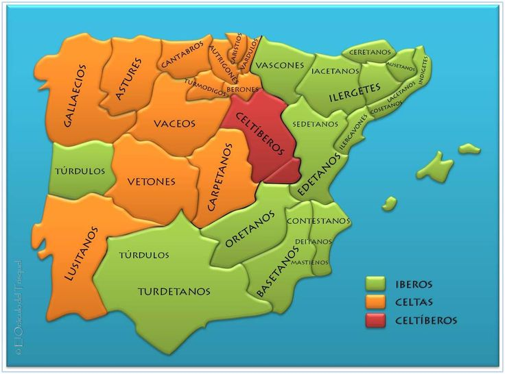
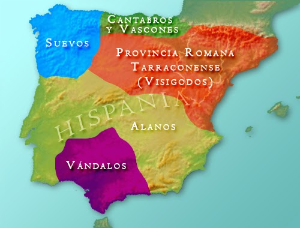
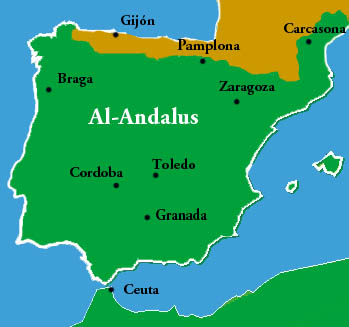
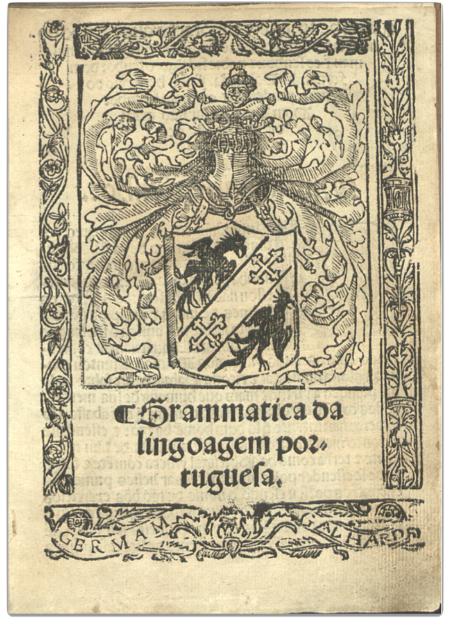
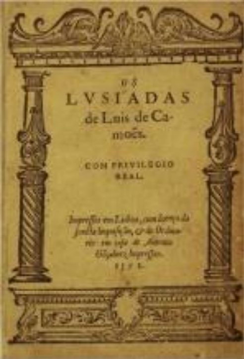

# latim-portugues

## Latim literário e latim vulgar

O português e as demais línguas neolatinas provêm do **latim vulgar**, a língua falada no dia a dia.

===

## Romance

romance < _romanice fabulare_ (falar à maneira dos romanos)

===

## Línguas românicas

#### Línguas nacionais

- **português**: Brasil, Portugal, Angola, Moçambique, São Tomé e Príncipe, Cabo Verde, Guiné-Bissau, Timor-Leste, Guiné Equatorial
- **espanhol**: Espanha, países da América Central e da América do Sul
- **francês**: França, Bélgica, parte da Suíça, parte do Canadá, Mônaco, Haiti, Tunísia, Marrocos, Senegal etc.
- **italiano**: Itália, Córsega
- **romeno**: Romênia, algumas regiões da Bulgária, Grécia e Macedônia

#### Línguas regionais

- **galego**: Galiza (região da Espanha)
- **catalão**: Catalunha (região da Espanha), Andorra (região de Valência), Ilhas Baleares (parte do sul da França)
- **provençal**: sudeste da França, parte da Suíça, norte da Itália
- **sardo**: Logudoro (região central da ilha da Sardenha)
- **rético**: Tirol (Áustria), Friúli (Itália), cantão dos Grisões (Suíça) | também chamado como reto-romano, romanche e ladino

===

## Povos ibéricos pré-romanos

===

## Substrato

Língua que, em determinada região, é assimilada pela língua do povo conquistador (estrato) e nesta deixa marcas perceptíveis.

===

## Origem comum

- nocte (latim) > noite (português)
- nocte (latim) > nuit (francês)
- nocte (latim) > notte (italiano)
- nocte (latim) > noapte (romeno)

===

## Fontes do latim vulgar

- Inscrições cristãs em túmulos
- Inscrições parietais (em paredes) ou os "graffiti" das ruínas de Pompeia
- Tabuinhas execratórias (_tabellae defixionum_)
- Tratados de veterinária
- Comédias de Plauto etc.

===

## Appendix Probi

a mais importante fonte do latim vulgar _[pequeno excerto]_

1. _porphireticum marmor non purpureticum marmur._
2. _tolonium non toloneum._
3. _speculum non speclum._
4. _masculus non masclus._
5. _vetulus non veclus._
6. _vitulus non viclus._
7. _vernaculus non vernaclus._
8. _articulus non articlus._
9. _baculus non vaclus._
10. _angulus non anglus._
11. _ iugulus non iuglus._
12. _calgostegis non calcosteis._
13. _septizonium non septidonium._
14. _vacua non vaqua._
15. _vacui non vaqui._

===

## Invasões germânicas

===

## Patronímico

- Martin**s** - filho de Martim
- Fernand**es** - filho de Fernando
- Henriqu**es** - filho de Henrique
- Sanch**es** - filho de Sancho
- Rodrigu**es** - filho de Rodrigo
- Vasqu**es** - filho de Vasco
- Nun**es** - filho de Nuno

===

## Ocupação árabe da Península Ibérica [_séc.VIII_]

===

## Superstrato

Língua do povo invasor que, embora não substitua a língua do território ocupado (estrato), deixa nela marcas perceptíveis.

#### Superstrato árabe

- enxoval
- chafariz
- tarifa
- azeite
- alface
- almôndega
- açúcar
- algodão
- açougue
- almofada
- corão/alcorão
- etc.

===

===

## Reconquista

- 1139: Batalha de Ourique, Dom Afonso vence os mouros e passa a usar o título de "rei de Portugal" (_rex portucalensis_)
- 1179: reconhecimento da independência de Portugal pelo papa Alexandre III
- 1249: sob Dom Afonso III, Portugal reconquista seu território aos árabes
- 1297: Dom Dinis, filho de Afonso III, assina o Tratado de Alcanises (definição da fronteira entre Portugal e Espanha)
- 1492: fim do domínio árabe na Península Ibérica, com a retomada de Granada pelos reis católicos Fernando e Isabel (Espanha)

===

**Dom Dinis** [_1261-1325_] (64 anos)

===

## Normativa real (sob Dom João IV)

> "[...] conviria que os médicos e cirurgiões fossem obrigados a receitar aos boticários as purgas, xaropes e medicinas que mandarem tomar aos enfermos em **linguagem** portuguesa, que as entendessem todos [...] e os ditos médicos e cirurgiões que receitarem essas mezinhas, sem ser em língua portuguesa, incorrerão em penas de 50 cruzados cada um [...] e os boticários que aceitarem as receitas em outra forma incorrerão outrossim em perdimento das medicinas para a Botica do Hospital Real de Todos os Santos desta cidade de Lisboa [...]." (Carta de Lei de 13 de março de 1656)

===

## Cantiga de amigo

> Ai flores, ai flores do verde pino
>
> se sabedes novas do meu amigo?
>
> Ai, Deus e u é?
>
> Ai flores, ai flores do verde ramo
>
> se sabedes novas do meu amado?
>
> Ai Deus, e u é?
>
> Se sabedes novas do meu amigo
>
> aquel que mentiu do que pôs conmigo?
>
> Ai Deus, e u é?
>
> Se sabedes novas do meu amado
>
> Aquel que mentiu do que mi há jurado
>
> Ai Deus, e u é?
>
> Vós me perguntades pelo voss'amigo
>
> E eu bem vos digo que é san'e vivo
>
> Ai Deus, e u é?
>
> Ai Deus, e u é?
>
> Vós me perguntades pelo voss'amado
>
> E eu bem vos digo que é viv'e sano
>
> Ai Deus, e u é?
>
> Ai Deus, e u é?
>
> E eu bem vos digo que é san'e vivo
>
> E será vosco ant'o prazo saído
>
> Ai Deus, e u é?
>
> Ai Deus, e u é?
>
> E eu bem vos digo que é viv'e sano
>
> E será voscant'o prazo passado
>
> Ai Deus, e u é?
>
> Ai Deus, e u é?
>
> Ai flores, ai flores do verde pino.
>
> (Dom Dinis, o rei trovador)

===

**Fernão de Oliveira** [_1507-1581_] (74 anos)

autor da primeira gramática portuguesa

===

**Os Lusíadas** [_1572_]

**Luís Vaz de Camões** [_1524-1580_] (56 anos)

===

**(padre) José de Anchieta**

autor da primeira gramática do tupi (a língua mais usada na costa do Brasil), publicada em 1595

===

## Língua geral

- **Língua geral paulista**: tupi falado em São Vicente e no Alto Rio Tietê + português dos colonos e missionários + línguas de indígenas de outras etnias, que eram deslocados para a região + fala dos mestiços (geralmente filhos de mãe indígena e de pai português)

- **Língua geral amazônica**: região dos atuais estados do Pará e do Maranhão, onde havia grande número de línguas indígenas (nheengatu = "língua boa")

#### Dificuldade dos missionários ante a quantidade e a diversidade de línguas indígenas

> "Se o Espírito Santo descera hoje em línguas milagrosas, como antigamente, não tinha tanta dificuldade o pregar aos Gentios; mas haverem-se de aprender essas línguas com estudo e com trabalho, é uma empresa muito dificultosa, e que só um grande amor de Deus pode vencer." (Sermão do Espírito Santo, Padre Antônio Vieira)

===
