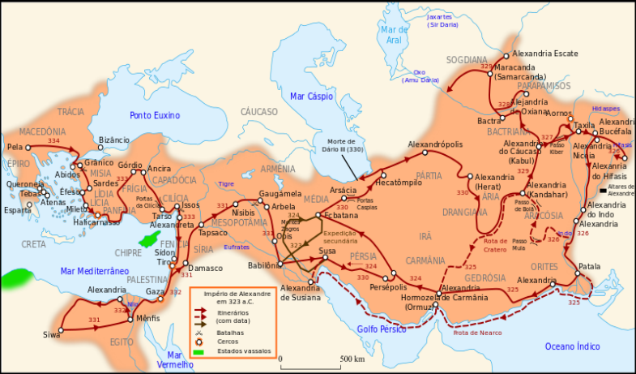
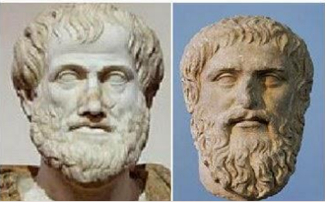
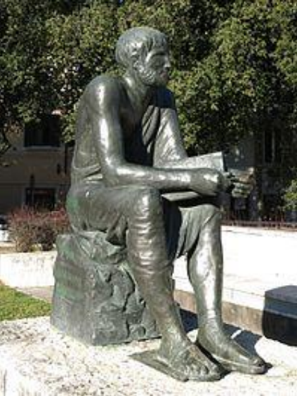
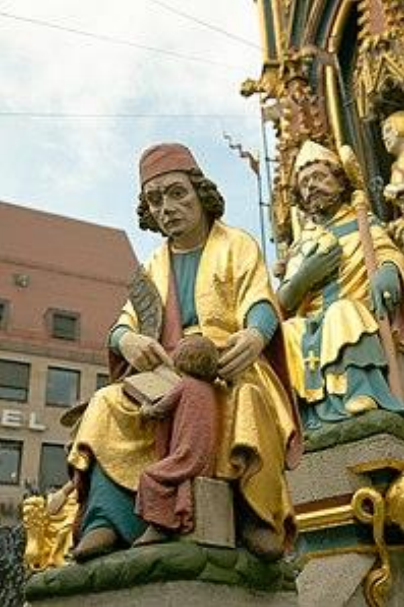
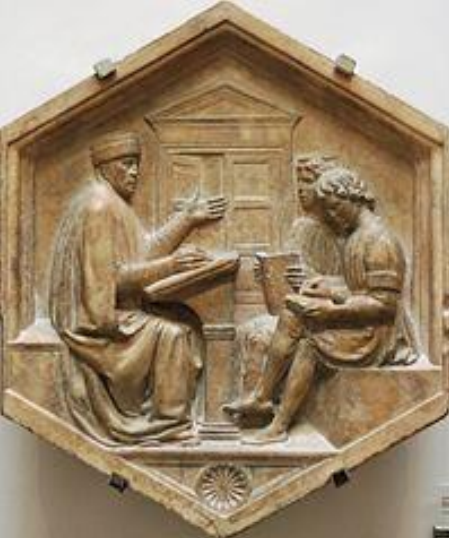
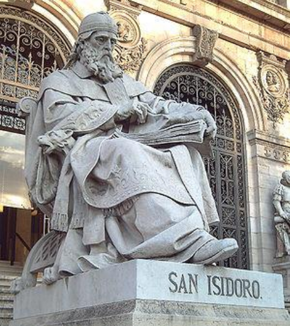

# surgimento

## A gramática

Grammatiké (grego) > gramática (port.)

===

> período helenístico [_323a.C.-146a.C._] (177 anos)

===

- **Aristóteles** [_384a.C.-322a.C._] (62 anos)
- **Platão** [_428a.C.-348a.C._] (80 anos)

===

> Biblioteca de Alexandria

===

## Poética - Manuel Bandeira

> Estou farto do lirismo comedido
>
> Do lirismo bem comportado
>
> Do lirismo funcionário público com livro de ponto expediente
>
> protocolo e manifestações de apreço ao Sr. Diretor.
>
> Estou farto do lirismo que para e vai averiguar no dicionário o cunho vernáculo de um vocábulo.
>
> **Abaixo os puristas**
>
> **Todas as palavras sobretudo os barbarismos universais**
>
> **Todas as construções sobretudo as sintaxes de exceção**
>
> **Todos os ritmos sobretudo os inumeráveis**
>
> [...]

===

## Grécia

- preservação da tradição cultural
- fixação de um padrão linguístico
- padrão baseado na língua literária

===

## Platão

- Crátilo
- Sofista

===

## Sofista

> Teeteto: que iremos ouvir agora a respeito das palavras?
>
> Estrangeiro: a questão consiste em saber se todas se combinam ou nenhuma; ou se algumas admitem esse acordo e outras não.
>
> Teeteto: é claro que umas o admitem e outras não.
>
> Estrangeiro: decerto, o que queres dizer é que as palavras pronunciadas numa determinada sequência e que formam sentido combinam entre si, não combinando as que na sua seriação nada significam.
>
> Teeteto: que queres dizer com isso?
>
> Estrangeiro: o que imaginei que estivesses pensando, quando concordaste comigo. Há duas maneiras de exprimir o ser por meio da voz.
>
> Teeteto: quais serão?
>
> Estrangeiro: uma é o gênero dos substantivos; a outra, o dos verbos.
>
> Teeteto: enumera-os.
>
> Estrangeiro: damos o nome de verbo aos sinais que denotam ação.
>
> Teeteto: certo.
>
> Estrangeiro: sendo substantivos os sinais articulados que referimos ao que realiza a ação.
>
> Teeteto: perfeitamente.
>
> Estrangeiro: ora, vários substantivos enunciados um depois do outro não chegam a formar sentença, o mesmo acontecendo com verbos enumerados sem substantivos.
>
> Teeteto: não compreendi.
>
> Estrangeiro: é que há pouco pensavas noutra coisa, quando concordaste comigo. O que eu queria dizer é que a simples sequência de verbos ou de substantivos não forma um discurso.
>
> Teeteto: como assim?
>
> Estrangeiro: é o seguinte: vai, corre, dorme e mil outros verbos denotadores de ação, ainda que enumerasse todos, em série, não chegariam a formar uma sentença.
>
> Teeteto: como o poderiam?
>
> Estrangeiro: o mesmo passa quando se diz: leão, cervo, cavalo, e todos os mais nomes denotadores de agentes; com semelhante sequência, também, jamais se comporá um discurso. Tanto neste caso como naquele, os vocábulos enunciados nem indicam ação nem inação, ou existência de um ser ou de um não-ser, até o momento de alguém juntar substantivos com verbos. Só então eles se completam, surgindo o discurso desde a primeira combinação, o que com acerto se poderia denominar a forma primitiva do discurso, a menor de conceber-se.
>
> Teeteto: que queres dizer com isso?
>
> Estrangeiro: quando se enuncia: o homem aprende, não dirás que se trata do discurso mais elementar e mais conciso?
>
> Teeteto: sem dúvida.
>
> Estrangeiro: é que, a partir desse instante, ele enuncia algo de alguma coisa que é ou se torna ou foi ou será; não se limita a nomeá-la, porém conta que alguma coisa aconteceu, o que consegue pelo entrelaçamento de verbos com substantivos. Daí não dizermos simplesmente que essa pessoa nomeia, porém que discursa, sendo a essa conexão de palavras que damos o nome de discurso.

===

## Gramáticos Alexandrinos

- **Zenótodo de Éfeso** [_330a.C-260a.C._] (70 anos)
- **Aristófanes de Bizâncio** [_257a.C-180a.C._] (77 anos)
- **Aristarco da Samotrácia** [_215a.C-144a.C._] (71 anos)
- **Dionísio, o Trácio** [_170a.C.-90a.C._] (80 anos)
- **Apolônio Díscolo** [_?-140d.C._]

===

## Gramáticas

#### Dionísio, o Trácio

Tékhnē Grammatikḗ (prosódia, figuras de linguagem, etimologia)

#### As oito partes do discurso

- nome
- verbo
- particípio
- pronome
- artigo
- advérbio
- preposição
- conjunção

#### Apolônio Díscolo

De sua vasta obra, conservaram-se apenas quatro trabalhos:

- Do pronome
- Das conjunções
- Dos advérbios
- Da sintaxe das partes do discurso

===

**Marco Terêncio Varrão** [_116a.C-27a.C._] (89 anos)

autor da primeira gramática latina

===

**Élio Donato** [_315d.C.-380d.C._] (65 anos)

autor da _Ars Grammatica_

===

**Priscianus Caesariensis (Prisciano)** [_séc.V-VI_]

autor de _Institutiones Grammaticae_ (Fundamentos Gramaticais)

síntese da tradição greco-romana

===

**(santo) Isidoro de Sevilha** [_560d.C-636d.C._] (76 anos)

autor de _Etymologiae_ (Etimologias)

sete artes liberais (_trivium + quadrivium_)

===

#### Trivium

- Gramática
- Dialética
- Retórica

#### Quadrivium

- Aritmética
- Geometria
- Astronomia
- Música

===
